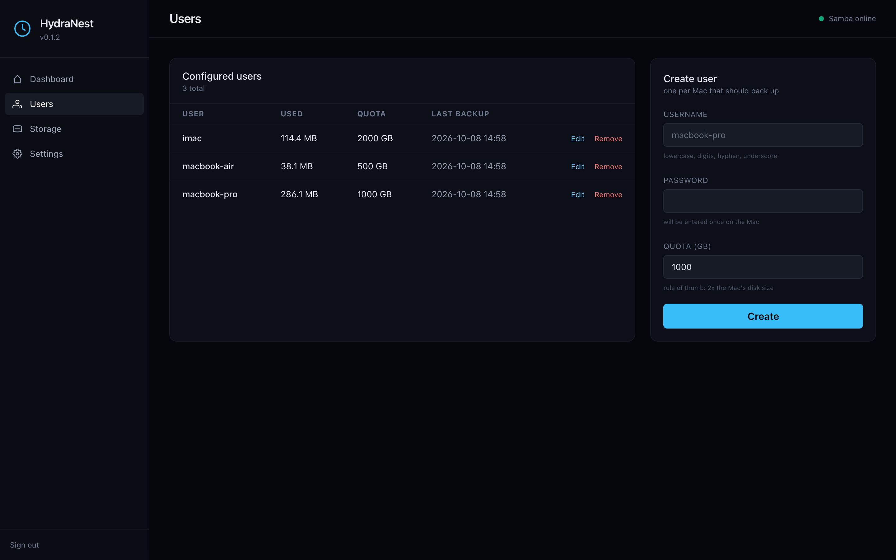
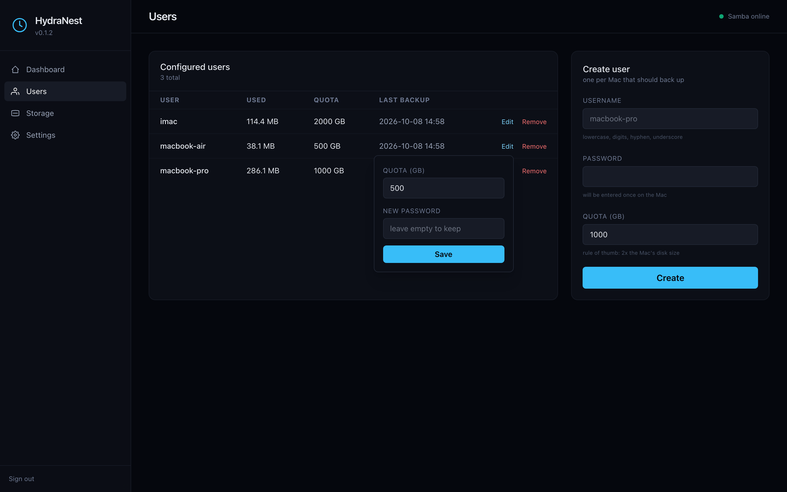
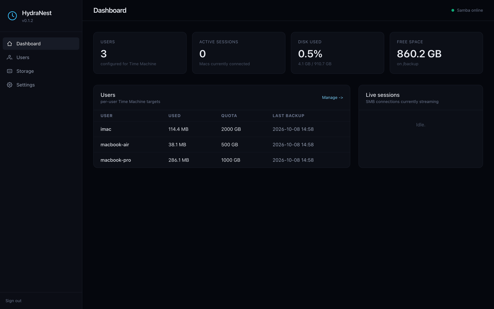
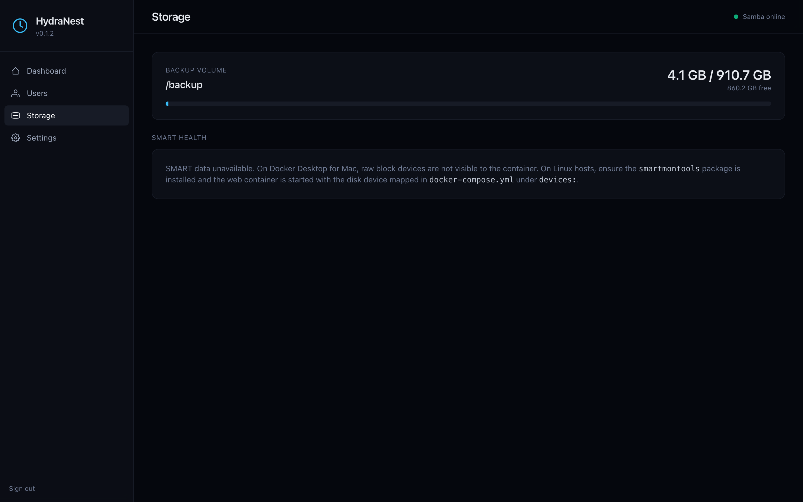
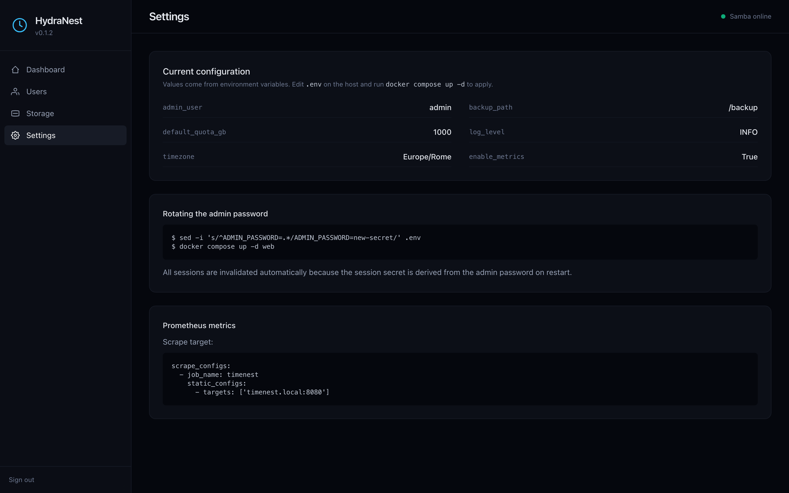
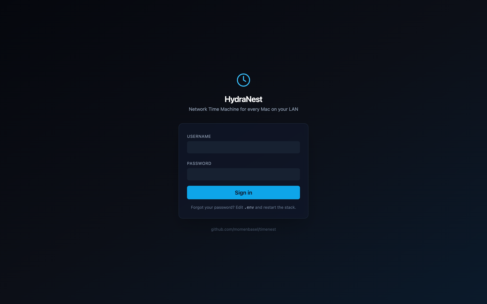

# HydraNest

**Network Time Machine server for every Mac on your LAN, deployed with Portainer.**

HydraNest turns a disk on a Linux / Proxmox / Docker host into a Time Machine
destination. It runs as one Docker stack:

| Container        | What it does                                                  |
| :--------------- | :------------------------------------------------------------ |
| `timenest-samba` | Samba 4 with `vfs_fruit`, one Time Machine share per user     |
| `timenest-avahi` | Bonjour/mDNS, so Macs find the server on their own            |
| `timenest-web`   | Admin web UI: users, quotas, passwords, storage, metrics      |

HydraNest is a fork of [momenbasel/timenest](https://github.com/momenbasel/timenest).
It fixes the Samba and user-management problems found when running it on
Proxmox + Portainer. See [What the fork fixes](#what-the-fork-fixes) and the
[CHANGELOG](CHANGELOG.md).



---

## Deploy with Portainer

### 1. Prepare the folders on the host

```bash
mkdir -p /TRE_TB/timenest/backups /TRE_TB/timenest/data
```

Use any paths you like. `backups` holds the Time Machine data, `data` holds
HydraNest's own state (Samba accounts, per-user share files, web UI data).

### 2. Create the stack

Portainer -> **Stacks** -> **Add stack**, then either:

- **Repository**: URL `https://github.com/Sebaf-26/HydraNest`, compose path
  `docker-compose.yml`, or
- **Web editor**: paste [`docker-compose.yml`](docker-compose.yml).

The compose file only pulls prebuilt public images
(`ghcr.io/sebaf-26/hydranest-{samba,avahi,web}`), nothing is built on the server.

### 3. Set the environment variables

```
BACKUP_PATH=/TRE_TB/timenest/backups
DATA_PATH=/TRE_TB/timenest/data
SERVER_NAME=TimeNest
DEVICE_MODEL=TimeCapsule8,119
ADMIN_USER=admin
ADMIN_PASSWORD=<strong password>
DEFAULT_QUOTA_GB=1000
TIMEZONE=Europe/Rome
LOG_LEVEL=INFO
ENABLE_METRICS=true
SMB_INTERFACES=eth0
WEB_PORT=8003
```

In Portainer, `BACKUP_PATH` and `DATA_PATH` **must be absolute paths**.
Relative paths would point inside Portainer's own data directory.

### 4. Deploy

Click **Deploy the stack** and open `http://<server-ip>:<WEB_PORT>`.

> **Coming from a TimeNest stack?** Delete the old stack first (the container
> names are the same, so the two can't run together). Your data lives in the
> host folders, so removing the stack doesn't touch it. Keep the same
> `BACKUP_PATH` / `DATA_PATH` and **don't mount a patched
> `entrypoint-samba.sh` any more**: the fixes are in the images.

### Updating

Portainer -> the stack -> **Update the stack** with **Re-pull image** enabled.

---

## Variables

| Variable           | Default            | What it does |
| :----------------- | :----------------- | :----------- |
| `BACKUP_PATH`      | required           | Host folder for the Time Machine backups (one subfolder per user) |
| `DATA_PATH`        | `./data`           | Host folder for HydraNest state: `samba/` (accounts), `config/shares.d/` (one `<user>.conf` per user), `web/` |
| `ADMIN_PASSWORD`   | required           | Web UI password |
| `ADMIN_USER`       | `admin`            | Web UI username |
| `WEB_PORT`         | `8080`             | Host port of the web UI. Change it if you get "port is already allocated" |
| `SERVER_NAME`      | `TimeNest`         | Name shown in Finder and Time Machine. Changing it later means re-selecting the disk on each Mac |
| `DEVICE_MODEL`     | `TimeCapsule8,119` | Model advertised to macOS (Finder icon). Also `Xserve`, `MacPro7,1`, `Macmini9,1` |
| `DEFAULT_QUOTA_GB` | `500`              | Quota pre-filled when creating a user |
| `SMB_INTERFACES`   | empty (all)        | Interfaces Samba binds to, e.g. `eth0`. Check with `ip -br addr` on the host |
| `TIMEZONE`         | `UTC`              | e.g. `Europe/Rome` |
| `LOG_LEVEL`        | `INFO`             | `DEBUG`, `INFO`, `WARNING`, `ERROR` |
| `ENABLE_METRICS`   | `true`             | Prometheus `/metrics` on the web UI port |

Samba and Avahi use `network_mode: host`: SMB is on port 445 of the host and
Bonjour announcements reach the LAN directly.

---

## Users

Create **one user per Mac** in the web UI (**Users** -> **Create user**) with
a password and a quota. Each user gets:

- a Samba account (stored in `DATA_PATH/samba/passdb.tdb`),
- a share file `DATA_PATH/config/shares.d/<user>.conf`,
- a backup folder `BACKUP_PATH/<user>`.

**Edit** on a user changes the quota and, optionally, the password. Changes
apply immediately, no restart needed. **Remove** deletes the account and the
share but **keeps the backup data** in `BACKUP_PATH/<user>`.

The quota is the size Time Machine sees for that share
(`fruit:time machine max size`). It is not a filesystem quota.



## Connecting a Mac

1. **System Settings -> General -> Time Machine -> Add Backup Disk**.
2. Pick the server (`SERVER_NAME`) and the share with the user's name.
3. Sign in with the HydraNest user and password (not your macOS password).
4. Enable backup encryption (recommended).

If the server doesn't appear, in Finder use **Go -> Connect to Server**
`smb://<server-ip>/<user>` once, then retry from Time Machine.

---

## Screenshots

| Dashboard | Storage |
| :-: | :-: |
|  |  |
| **Settings** | **Login** |
|  |  |

---

## Troubleshooting

```bash
# Startup log: restored users and loaded share files
docker logs timenest-samba --tail 50

# Is a user's share loaded?
docker exec timenest-samba testparm -s 2>/dev/null | grep -A20 '^\[sebaf\]'

# Interfaces Samba listens on
docker exec timenest-samba testparm -s 2>/dev/null | grep interfaces

# Samba accounts and POSIX user
docker exec timenest-samba pdbedit -L
docker exec timenest-samba id sebaf

# Share files on the host
ls -la /TRE_TB/timenest/data/config/shares.d/

# SMB login test
docker exec -it timenest-samba smbclient //127.0.0.1/sebaf -U sebaf -c ls

# Web UI log
docker logs timenest-web --tail 100
```

| Symptom | Meaning / fix |
| :------ | :------------ |
| `NT_STATUS_LOGON_FAILURE` | Wrong username/password. Reset it with **Edit** in the web UI |
| `NT_STATUS_BAD_NETWORK_NAME` | Login worked but the share is not loaded: check that `<user>.conf` exists in `shares.d` and appears in `testparm -s` |
| Web UI shows **0 users** | The web container doesn't see `shares.d`: `DATA_PATH` must be the same for all services (it is, if you use this compose file unchanged) |
| `port is already allocated` | Change `WEB_PORT` |
| `container name "/timenest-samba" is already in use` | An old TimeNest stack is still running: delete it (data stays on the host) |
| Mac doesn't see the server | Avahi must run with host networking; on the Mac, `dns-sd -B _smb._tcp` should list it |

---

## What the fork fixes

| Problem in TimeNest | Fix in HydraNest |
| :------------------ | :--------------- |
| `smbd` exits at start: `Invalid option --log-stdout` (Samba 4.17) | The entrypoint uses `--debug-stdout` or `--log-stdout`, whichever the installed Samba supports |
| Share not loaded (`BAD_NETWORK_NAME`): Samba ignores the wildcard in `include = .../shares.d/*.conf` | One explicit `include` per user is generated at startup and on every user change |
| Users stop working after a redeploy (POSIX users lived only inside the container) | Users are recreated at startup with their original UID/GID |
| Mounting `/etc/timenest` hid the templates (`smb.conf.template: No such file`) | Templates moved to `/usr/share/timenest`; only `shares.d` is mounted |
| Web UI shows 0 users | The web container reads the same `shares.d` as Samba (`SHARES_PATH`) |
| Quota and password could only be changed by hand | **Edit** button in the web UI |
| `interfaces = lo` rendered when `SMB_INTERFACES` is empty | The line is omitted |

---

## Without Portainer

```bash
git clone https://github.com/Sebaf-26/HydraNest.git && cd HydraNest
cp .env.example .env    # set BACKUP_PATH, ADMIN_PASSWORD, ...
docker compose up -d
```

`./install.sh` does the same interactively on Debian/Ubuntu/Raspberry Pi OS.
For development, build the images locally as described in
[CONTRIBUTING.md](CONTRIBUTING.md).

## Monitoring

With `ENABLE_METRICS=true`, `http://<server>:<WEB_PORT>/metrics` exposes
`timenest_users_total`, `timenest_sessions_active`,
`timenest_backup_bytes_used`, `timenest_backup_quota_bytes`,
`timenest_last_backup_timestamp_seconds`, `timenest_disk_total_bytes`,
`timenest_disk_free_bytes`.

## Security

- Don't expose port 445 or the web UI to the internet. For remote backups use a VPN (WireGuard, Tailscale).
- SMB1 is disabled, SMB signing is mandatory.
- The web container mounts `/var/run/docker.sock` to manage Samba users via `docker exec`: treat the web UI password like root access to the host.

## License

MIT, like the original project. See [LICENSE](LICENSE).
Original work © momenbasel/timenest contributors.
